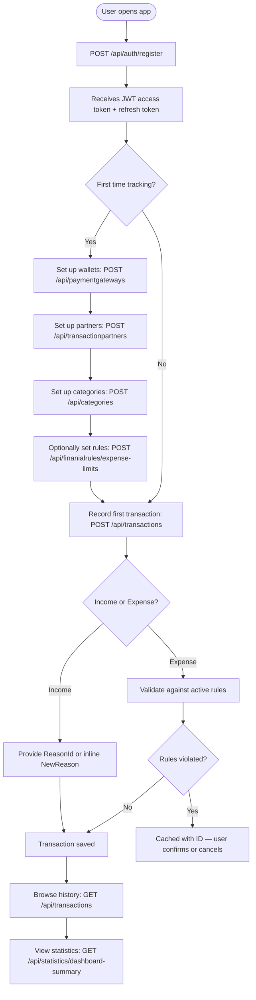
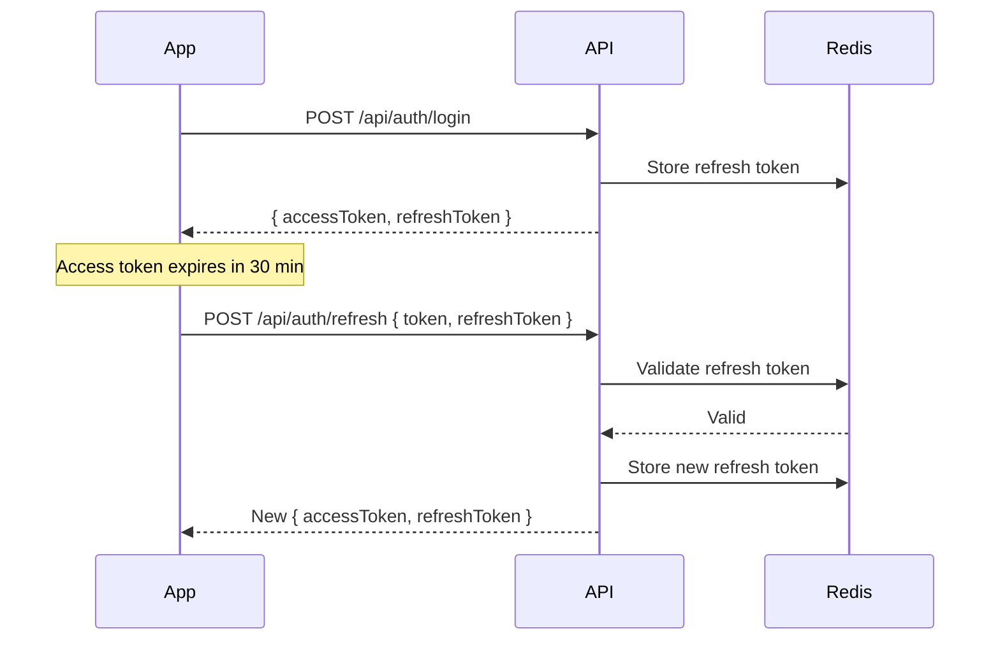
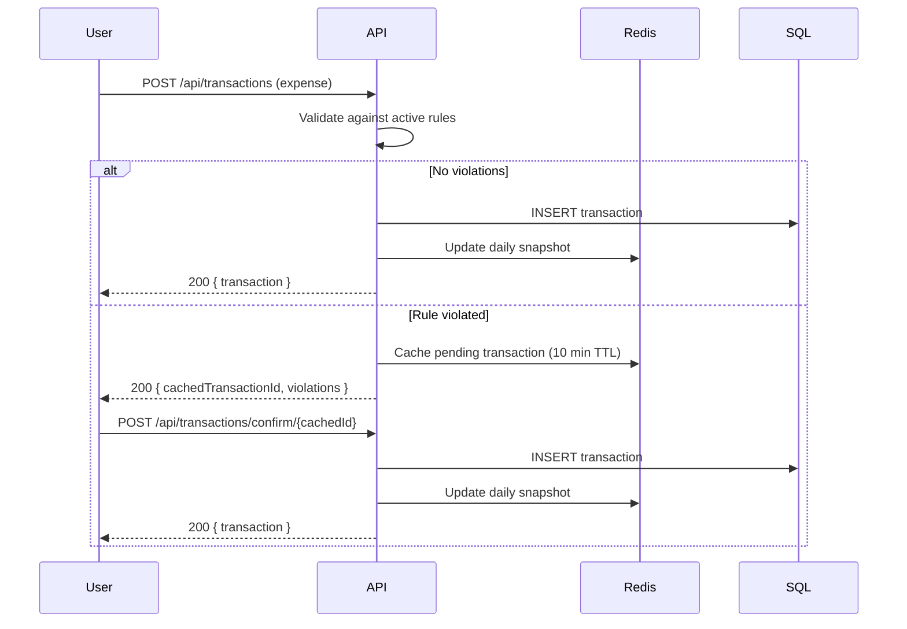

# 💰 Personal Budget Tracker API

> A self-hosted, privacy-first ASP.NET Core REST API that gives you complete visibility and control over your personal finances — every transaction tracked, every rule enforced, every pattern surfaced.

---

## ✨ Why This Exists

Most people know roughly how much they earn. Very few know exactly where it goes.

This API was built to answer the four fundamental questions behind every financial event:

| Question | Answered by |
|----------|-------------|
| **How much?** | `Transaction.Amount` |
| **Through which wallet?** | `PaymentGateway` |
| **With whom?** | `TransactionPartner` |
| **Why? / What for?** | `Reason` (income) or `Category` (expense) |

### Problems it solves for users

- **"I don't know where my money goes"** — Every expense is tagged by category, partner, and payment method. Nothing is unaccounted for.
- **"I keep overspending on dining / subscriptions"** — Expense limit rules fire a warning when you approach your self-set cap, and block (with confirmation) when you exceed it.
- **"I forget recurring payments"** — Scheduled transactions generate pending occurrences on their due date and ask for your confirmation before recording the expense.
- **"I don't know if I'm saving enough"** — Saving goal rules track net balance growth over a period and tell you whether you are on track, approaching, or off target.
- **"I can't see patterns across months"** — The statistics engine surfaces top spending categories, income vs. expense ratios, period-over-period changes, and daily averages — all from pre-aggregated data, not slow SQL scans.
- **"I have multiple wallets and want separate limits"** — Every rule can be scoped to all gateways or to a single payment gateway, independently.

---

## 🏗 How It's Built — Technical Highlights

This is not a simple CRUD API. It combines a relational database, two NoSQL stores, and a background job engine to deliver real-time financial intelligence without sacrificing read performance.

### Two-Layer Snapshot Architecture

Raw transaction data lives in SQL Server. But rule evaluation and statistics never touch it directly.

```
Every new transaction
      │
      ├── INSERT → SQL Server (source of truth, immutable)
      │
      └── HINCRBYFLOAT → Redis Hash (live daily snapshot)
                │
          Midnight job
                │
          INSERT → MongoDB (completed day document)
                │
          RESET Redis (clean slate for next day)
```

**Redis** holds today's running totals — total income, total expense, per-gateway breakdowns, per-category spending, per-partner spending — updated atomically on every transaction write with `HINCRBYFLOAT`. No race conditions, no locks.

**MongoDB** holds completed day documents, partitioned by user and month. Rule evaluation reads completed days from MongoDB and today from Redis, combines them, and computes the result in milliseconds regardless of how many years of history the user has.

This means:
- Rule evaluation is **O(d)** where d = days in the rule period — never O(T) where T = total transactions
- Statistics queries scan at most 365 small documents — not thousands of transaction rows
- Write cost per transaction is **O(1)** — a fixed set of Redis field increments

### Financial Rules Engine

Three rule types enforced on every expense transaction before it is saved:

| Rule | Fires when |
|------|-----------|
| **ExpenseLimitRule** | Spending in a category/partner/gateway exceeds a threshold (fixed or % of income) |
| **MinimumBalanceRule** | Balance would drop below a floor after this transaction |
| **SavingRule** | Informational — tracks net savings progress toward a goal |

When a transaction violates a rule, it is **cached in Redis** with a generated ID and returned to the user with the violated rules listed. The user can then confirm or cancel via a dedicated endpoint — the cached transaction is applied only on explicit confirmation. Near-limit warnings (configurable, default 80% of threshold) pass through but are surfaced in the response.

### Scheduled Transactions

A template system for recurring payments (subscriptions, salary, rent). A Hangfire job runs daily and generates pending **occurrences** for each due scheduled transaction. The user sees them in a pending queue and confirms each one — confirmation runs the same transaction creation logic, including rule validation.

---

## 📌 Business Overview

### Core Domain: Transactions

A **Transaction** is the central entity. Every financial event is recorded as one of two concrete types:

- **Income** — money received. Linked to a **Reason** (e.g., "Salary", "Freelance payment").
- **Expense** — money spent. Linked to a **Category** (e.g., "Food", "Rent") and carries an optional `FeeAmount` for bank/transfer fees.

Both types share a single `Transactions` table using **Table-Per-Hierarchy (TPH)** inheritance with an EF Core `Discriminator` column.

### Supporting Entities

| Entity | Role |
|--------|------|
| **PaymentGateway** | The user's wallets and payment instruments (cash, Visa, PayPal, etc.). Every transaction flows through exactly one gateway. |
| **Category** | Spending classification for expenses. Has an `IsNeedful` flag and `NeedPriority` score to help distinguish essential from discretionary spending. |
| **Reason** | Income classification (e.g., "Monthly salary", "Side project"). |
| **TransactionPartner** | The other party in a transaction — a person, merchant, or company. |

### Key Business Rules

- Every transaction must specify **either** an existing `PaymentGatewayId` **or** a new gateway inline — never both.
- **Income** transactions require a reason; `CategoryId` and `FeeAmount` are rejected.
- **Expense** transactions require a category and `FeeAmount ≥ 0`; `ReasonId` is rejected.
- Transaction `Date` cannot be in the future.
- All data is **soft-deleted** — nothing is physically removed from the database.
- Transactions are **immutable** — no edits or deletes after creation.

---

## 🗂 Domain Model

### Entity Inheritance (TPH)

```
AuditableEntity  (CreatedAt, CreatedBy, UpdatedAt, UpdatedBy, IsDeleted, DeletedAt, DeletedBy)
│
└── Transaction  (TransactionId, Amount, Title, TransactionDetails, Date, PaymentType, PaymentGatewayId, TransactionPartnerId)
        │
        ├── Income   (+ ReasonId → Reason)
        │
        └── Expense  (+ CategoryId → Category, FeeAmount)
```

### Financial Rules (TPH)

```
FinancialRule  (Id, Title, Notes, ValueType, Value, ScopeType, PaymentGatewayId, PeriodType, PeriodStart, PeriodEnd, RecurrenceMode, IsActive)
│
├── ExpenseLimitRule   (+ TargetType, CategoryId, TransactionPartnerId)
├── MinimumBalanceRule
└── SavingRule
```

---

## 🧭 User Journey

### New User Flow



### Token Lifecycle



### Rule Violation Flow



---

## 🗺 API Map

> All routes except `/api/auth/*` require `Authorization: Bearer <JWT>`.

### Authentication — `/api/auth`

| Method | Route | Description |
|--------|-------|-------------|
| `POST` | `/api/auth/register` | Register a new user. Returns JWT + refresh token. |
| `POST` | `/api/auth/login` | Authenticate. Returns JWT + refresh token. |
| `POST` | `/api/auth/refresh` | Exchange expired JWT + refresh token for a new pair. |

### Transactions — `/api/transactions`

| Method | Route | Description |
|--------|-------|-------------|
| `GET` | `/api/transactions` | List all user transactions with rich filtering. Paginated. |
| `GET` | `/api/transactions/{id}` | Get full details of a single transaction. |
| `POST` | `/api/transactions` | Create an income or expense transaction. Inline creation of partner, gateway, category, or reason supported. |
| `POST` | `/api/transactions/confirm/{cachedId}` | Confirm a rule-violated pending transaction from Redis cache. |
| `GET` | `/api/transactions/requirements` | Pre-flight check: tells the client whether required entities are set up. |

### Scheduled Transactions — `/api/scheduled-transactions`

| Method | Route | Description |
|--------|-------|-------------|
| `GET` | `/api/scheduled-transactions` | List scheduled transaction templates. |
| `GET` | `/api/scheduled-transactions/{id}` | Get a specific scheduled transaction. |
| `POST` | `/api/scheduled-transactions` | Create a recurring transaction template. |
| `PATCH` | `/api/scheduled-transactions/{id}/deactivate` | Deactivate a schedule. |
| `GET` | `/api/scheduled-transactions/occurrences/pending` | Get pending occurrences due for confirmation. |
| `POST` | `/api/scheduled-transactions/occurrences/{occurrenceId}/confirm` | Confirm a due occurrence — creates the actual transaction. |
| `POST` | `/api/scheduled-transactions/occurrences/{occurrenceId}/skip` | Skip a due occurrence. |
| `POST` | `/api/scheduled-transactions/occurrences/{occurrenceId}/seen` | Mark occurrence as seen. |

### Financial Rules — `/api/finanialrules`

| Method | Route | Description |
|--------|-------|-------------|
| `GET` | `/api/finanialrules` | List all user financial rules with filters. |
| `POST` | `/api/finanialrules/expense-limits` | Create an expense limit rule. |
| `POST` | `/api/finanialrules/minimum-balances` | Create a minimum balance rule. |
| `POST` | `/api/finanialrules/saving-goals` | Create a saving goal rule. |
| `PUT` | `/api/finanialrules/expense-limits/{id}` | Update an expense limit rule. |
| `PUT` | `/api/finanialrules/minimum-balances/{id}` | Update a minimum balance rule. |
| `PUT` | `/api/finanialrules/saving-goals/{id}` | Update a saving goal rule. |
| `GET` | `/api/finanialrules/saving-goals-status` | Current progress for all saving goals. |
| `PATCH` | `/api/finanialrules/{id}/activate` | Activate a rule. |
| `PATCH` | `/api/finanialrules/{id}/deactivate` | Deactivate a rule. |

### Statistics — `/api/statistics`

| Method | Route | Description |
|--------|-------|-------------|
| `GET` | `/api/statistics/dashboard-summary` | Full dashboard: ratio, average, top categories, top partners. |
| `GET` | `/api/statistics/top-categories` | Top N spending categories in a date range. |
| `GET` | `/api/statistics/top-partners` | Top N transaction partners by expense in a date range. |
| `GET` | `/api/statistics/expense-income-ratio` | Total income vs expense with net savings and savings rate. |
| `GET` | `/api/statistics/average-daily-expense` | Average daily expense over a date range. |
| `GET` | `/api/statistics/period-over-period-change` | Compare current period income and expense to the equivalent prior period. |

### Payment Gateways — `/api/paymentgateways`

| Method | Route | Description |
|--------|-------|-------------|
| `GET` | `/api/paymentgateways` | List all of the current user's payment gateways. |
| `GET` | `/api/paymentgateways/{id}` | Get full gateway details. |
| `POST` | `/api/paymentgateways` | Create a new payment gateway. |
| `GET` | `/api/paymentgateways/{id}/transactions` | List all transactions through a specific gateway. |

### Categories — `/api/categories`

| Method | Route | Description |
|--------|-------|-------------|
| `GET` | `/api/categories` | Search and list categories. Filterable by `isNeedful`, priority range. |
| `GET` | `/api/categories/{id}` | Get category details. |
| `POST` | `/api/categories` | Create a new spending category. |
| `PUT` | `/api/categories/{id}` | Update a category. |
| `DELETE` | `/api/categories/{id}` | Soft-delete a category. |
| `GET` | `/api/categories/{id}/transactions` | List all expenses under this category. |

### Reasons — `/api/reasons`

| Method | Route | Description |
|--------|-------|-------------|
| `GET` | `/api/reasons` | List income reasons. Supports search. Paginated. |
| `GET` | `/api/reasons/details` | List reasons with full transaction details. |
| `GET` | `/api/reasons/{id}/transactions` | List all income transactions under this reason. |

### Transaction Partners — `/api/transactionpartners`

| Method | Route | Description |
|--------|-------|-------------|
| `GET` | `/api/transactionpartners` | List all transaction partners. Paginated. |
| `GET` | `/api/transactionpartners/{id}` | Get partner details. |
| `POST` | `/api/transactionpartners` | Create a new transaction partner. |
| `PUT` | `/api/transactionpartners/{id}` | Update partner info. |
| `DELETE` | `/api/transactionpartners/{id}` | Soft-delete a partner. |
| `GET` | `/api/transactionpartners/{id}/transactions` | List all transactions with this partner. |

### Roles — `/api/roles` (Admin only)

| Method | Route | Description |
|--------|-------|-------------|
| `POST` | `/api/roles/create-role` | Create a new Identity role. |
| `POST` | `/api/roles/assign-role` | Assign a role to a user. |

---

## ⚙️ Technical Details

### Architecture

```
Request
  └─► ExceptionMiddleware           (global error handling + ProblemDetails)
        └─► AuthenticationMiddleware (JWT validation)
              └─► Controller         (route handling, DTO binding, FluentValidation)
                    └─► Service      (business logic + rule evaluation)
                          ├─► EF Core DbContext  (SQL Server — source of truth)
                          ├─► Redis              (live snapshots + token store + pending tx cache)
                          └─► MongoDB            (completed day snapshots for analytics)
```

### Tech Stack

| Layer | Technology |
|-------|-----------|
| Language | C# / .NET |
| Framework | ASP.NET Core Web API |
| ORM | Entity Framework Core (TPH, global filters, audit interceptor) |
| Primary Database | SQL Server (LocalDB for dev) |
| Cache / Live Snapshots | Redis (StackExchange.Redis) |
| Historical Snapshots | MongoDB (MongoDB.Driver) |
| Background Jobs | Hangfire (SQL Server storage) |
| Auth | ASP.NET Identity + JWT Bearer |
| Validation | FluentValidation |
| API Docs | OpenAPI + Scalar UI |

### Snapshot Data Model

**Redis — Live Daily Hash** (one hash per user per day, TTL 48h):

```
finance:{userId}:{yyyy-MM-dd}
  totalTransactions
  totalIncome
  totalExpense
  gateway:{gwId}:totalIncome
  gateway:{gwId}:totalExpense
  gateway:{gwId}:cat:{catId}
  gateway:{gwId}:partner:{partnerId}
  cat:{catId}
  partner:expense:{partnerId}
  partner:income:{partnerId}
```

**MongoDB — Monthly Document** (one document per user per month):

```json
{
  "_id": "{userId}:{yyyy-MM}",
  "userId": "...",
  "month": "2025-05",
  "days": {
    "2025-05-01": { "totalIncome": 500, "totalExpense": 300, "paymentGateways": { ... }, ... },
    "2025-05-07": { ... }
  },
  "updatedAt": "..."
}
```

### Background Jobs (Hangfire)

| Job | Schedule | Purpose |
|-----|----------|---------|
| `SnapshotPromotionJob` | 00:05 UTC daily | Promotes yesterday's Redis snapshots to MongoDB |
| `SnapshotPromotionJob` (double-check) | 01:00 UTC daily | Catches any late transactions missed by main run |
| `RuleActivationJob` | Configurable | Re-activates recurring rules after period ends |
| `RuleDeactivationJob` | Configurable | Deactivates expired one-time rules |
| `ScheduledTransactionProcessingJob` | 08:00 UTC daily | Generates pending occurrences for due scheduled transactions |

### Soft Delete via Global Query Filters

Every entity registers an EF Core global query filter:

```csharp
modelBuilder.Entity<Transaction>().HasQueryFilter(t => !t.IsDeleted && t.CreatedBy == userId);
```

Deletion is intercepted in `SaveChanges()` — `EntityState.Deleted` is converted to `EntityState.Modified` with `IsDeleted = true`.

### Audit Trail

`ApplyAuditInfo()` automatically stamps every entity on every save:

| State | Fields set |
|-------|-----------|
| `Added` | `CreatedAt`, `CreatedBy` |
| `Modified` | `UpdatedAt`, `UpdatedBy` |
| `Deleted` | `IsDeleted = true`, `DeletedAt`, `DeletedBy` |

---

## 🔧 Infrastructure & Configuration

### `appsettings.json` Keys

```json
{
  "ConnectionStrings": {
    "Default": "Data Source=(localdb)\\MSSQLLocalDB;Initial Catalog=BudgetDatabase;..."
  },
  "Jwt": {
    "Key": "<your-secret-key-min-32-chars>",
    "Issuer": "PersonalBudgetTrackerAPI",
    "Audience": "PersonalBudgetTrackerAPIUsers",
    "ExpireTimeMinuts": 30
  },
  "RefreshToken": {
    "ExpireTimeMinuts": 60
  },
  "Redis": {
    "ConnectionString": "localhost:6379"
  },
  "MongoDB": {
    "ConnectionString": "mongodb://localhost:27017",
    "DatabaseName": "PersonalBudgetTracker",
    "DailySnapshotsCollection": "DailySnapshots"
  },
  "DailySnapshot": {
    "TtlHours": 48
  },
  "RuleValidation": {
    "NearLimitThresholdPercentage": 80
  }
}
```

### Docker Compose — Infrastructure

Redis, MongoDB, and Mongo Express run in Docker. The .NET API runs locally for fast development iteration.

```bash
cd docker
docker compose up -d
```

| Service | URL |
|---------|-----|
| Redis | `localhost:6379` |
| RedisInsight | `http://localhost:8001` |
| MongoDB | `localhost:27017` |
| Mongo Express | `http://localhost:8081` |

---

## 🚀 Getting Started

### Prerequisites

- .NET SDK
- SQL Server (LocalDB or full instance)
- Docker Desktop (for Redis + MongoDB)

### Steps

1. **Clone the repository**
   ```bash
   git clone https://github.com/EngAbdoS/PersonalBudgetTrackerAPI.git
   cd PersonalBudgetTrackerAPISolution
   ```

2. **Start infrastructure**
   ```bash
   cd docker
   docker compose up -d
   ```

3. **Configure connection strings**
   Update `appsettings.json` with your SQL Server connection string. Redis and MongoDB point to `localhost` by default.

4. **Apply EF Core migrations**
   ```bash
   dotnet ef database update --project PersonalBudgetTrackerAPI
   ```

5. **Run the API**
   ```bash
   dotnet run --project PersonalBudgetTrackerAPI
   ```

6. **Open Scalar UI**
   Navigate to `https://localhost:{port}/scalar/v1` to explore and test interactively.

### Quick Test Flow

```bash
# 1. Register
curl -X POST https://localhost:5001/api/auth/register \
  -H "Content-Type: application/json" \
  -d '{"username":"john","email":"john@example.com","password":"Pass@123","fullName":"John Doe"}'

# 2. Login — copy the accessToken
curl -X POST https://localhost:5001/api/auth/login \
  -H "Content-Type: application/json" \
  -d '{"username":"john","password":"Pass@123"}'

# 3. Create a payment gateway
curl -X POST https://localhost:5001/api/paymentgateways \
  -H "Authorization: Bearer <accessToken>" \
  -H "Content-Type: application/json" \
  -d '{"title":"My Wallet","paymentGatewayType":6,"initialBalance":1000}'

# 4. Set an expense limit rule
curl -X POST https://localhost:5001/api/finanialrules/expense-limits \
  -H "Authorization: Bearer <accessToken>" \
  -H "Content-Type: application/json" \
  -d '{
    "title": "Monthly food limit",
    "valueType": 1,
    "value": 500,
    "scopeType": 0,
    "periodType": 2,
    "recurrenceMode": 1,
    "targetType": 0,
    "categoryId": "<categoryId>"
  }'

# 5. Record an expense — will be validated against rules
curl -X POST https://localhost:5001/api/transactions \
  -H "Authorization: Bearer <accessToken>" \
  -H "Content-Type: application/json" \
  -d '{
    "amount": 250,
    "title": "Groceries",
    "paymentType": 1,
    "isIncome": false,
    "paymentGatewayId": "<gatewayId>",
    "transactionPartnerId": "<partnerId>",
    "categoryId": "<categoryId>",
    "feeAmount": 0
  }'

# 6. Check statistics
curl "https://localhost:5001/api/statistics/dashboard-summary?from=2025-05-01" \
  -H "Authorization: Bearer <accessToken>"
```

---

## 🤝 Contributing

1. Fork the repository and create a feature branch:
   ```bash
   git checkout -b feature/your-feature-name
   ```
2. Follow the existing layered pattern: Controller → Service Interface → Service Implementation.
3. Add FluentValidation validators for any new DTO.
4. Ensure all new entities inherit from `AuditableEntity` for automatic audit and soft-delete.
5. Run the project and verify via Scalar UI before submitting a PR.
6. Submit a Pull Request with a clear description of what changed and why.

---

## 📄 License

This project is licensed under the **MIT License**.