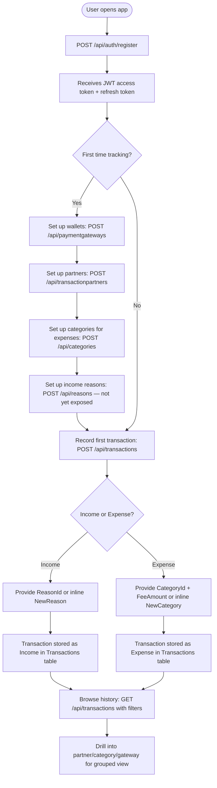
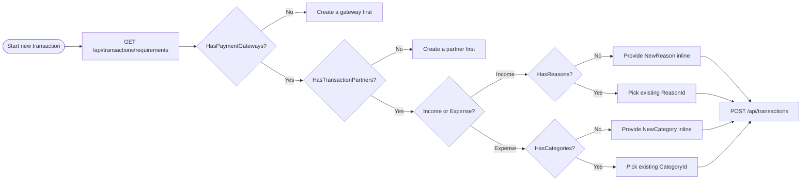
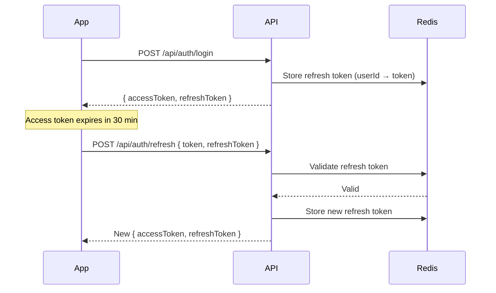
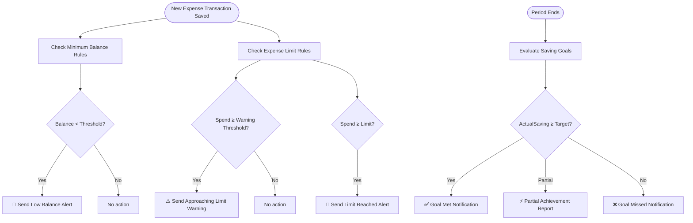

# 💰 Personal Budget Tracker API

> A self-hosted, privacy-first ASP.NET Core REST API that lets you track every penny — where it came from, who was involved, which wallet it moved through, and what it was spent on.

---

## Table of Contents

- [Business Overview](#-business-overview)
- [Domain Model](#-domain-model)
- [User Journey](#-user-journey)
- [API Map](#-api-map)
- [Request & Response Contracts](#-request--response-contracts)
- [Technical Details](#-technical-details)
- [Infrastructure & Configuration](#-infrastructure--configuration)
- [Getting Started](#-getting-started)
- [Future Features](#-future-features)
- [Contributing](#-contributing)

---

## 📌 Business Overview

### What is this?

Personal Budget Tracker API is a **personal finance tracking backend** that answers four fundamental money questions every time a transaction is recorded:

| Question | Answered by |
|----------|-------------|
| **How much?** | `Transaction.Amount` |
| **Through which wallet / payment method?** | `PaymentGateway` |
| **With whom?** | `TransactionPartner` |
| **Why? / What for?** | `Reason` (income) or `Category` (expense) |

### Core Domain: Transactions

A **Transaction** is the central entity. Every financial event — whether money came in or went out — is recorded as a Transaction. Transactions are split into two concrete types:

- **Income** — money received. Linked to a **Reason** (e.g., "Salary", "Freelance payment", "Gift").
- **Expense** — money spent. Linked to a **Category** (e.g., "Food", "Rent", "Entertainment") and can carry an extra `FeeAmount` (bank/transfer fees).

Both types share a common base (`Transaction`) stored in a **single database table** using **Table-Per-Hierarchy (TPH)** inheritance with an EF Core `Discriminator` column (`"Income"` / `"Expense"`).

### Supporting Entities

| Entity | Role |
|--------|------|
| **PaymentGateway** | The user's wallets and payment instruments (cash wallet, Visa card, PayPal account, etc.). Every transaction flows through exactly one gateway. |
| **Category** | Spending classification for expenses (e.g., "Groceries", "Utilities"). Has a `IsNeedful` flag and `NeedPriority` score to help the user understand essential vs. discretionary spending. |
| **Reason** | Income classification (e.g., "Monthly salary", "Side project"). |
| **TransactionPartner** | The other party in a transaction — a person, a merchant, a company. Stores name, contact info, and location. |

### Key Business Rules (enforced by FluentValidation)

- Every transaction must specify **either** an existing `PaymentGatewayId` **or** a new gateway inline — never both.
- Every transaction must specify **either** an existing `TransactionPartnerId` **or** a new partner inline — never both.
- **Income** transactions must have a reason; `CategoryId` and `FeeAmount` are rejected.
- **Expense** transactions must have a category and a `FeeAmount ≥ 0`; `ReasonId` is rejected.
- Transaction `Date` cannot be in the future.
- Transaction `Amount` must be greater than 0.
- All data is **soft-deleted** — nothing is ever physically removed from the database.

---

## 🗂 Domain Model

### Entity Inheritance (TPH)

```
AuditableEntity  (CreatedAt, CreatedBy, UpdatedAt, UpdatedBy, IsDeleted, DeletedAt, DeletedBy)
│
└── Transaction  (TransactionId, Amount, Title, TransactionDetails, Date, PaymentType, PaymentGatewayId, TransactionPartnerId)
        │
        ├── Income   (+ ReasonId → Reason)
        │
        └── Expense  (+ CategoryId → Category, FeeAmount)
```

### PaymentGateway

```
PaymentGateway : AuditableEntity
├── Id              : Guid
├── Title           : string       — friendly name (e.g., "My Visa Card")
├── Description     : string
├── BankName        : string
├── PaymentGatewayType : enum      — Visa | MasterCard | PayPal | ApplePay | GooglePay | Wallet | Other
├── InitialBalance  : decimal
└── ExpirationDate  : DateTime
```

### Category (Expense classification)

```
Category : AuditableEntity
├── Id           : Guid
├── Title        : string       — e.g., "Groceries"
├── Details      : string
├── IsNeedful    : bool         — essential spending flag
└── NeedPriority : decimal      — priority score (filterable)
```

### Reason (Income classification)

```
Reason : AuditableEntity
├── Id            : Guid
└── ReasonDetails : string      — e.g., "Monthly salary from Acme Corp"
```

### TransactionPartner

```
TransactionPartner : AuditableEntity
├── Id       : Guid
├── Name     : string      — e.g., "Amazon", "John Doe"
├── Info     : string      — additional info / notes
├── Location : string
└── Contact  : string
```

### AuditableEntity (base for all entities)

```
AuditableEntity
├── CreatedAt  : DateTime
├── CreatedBy  : string?
├── UpdatedAt  : DateTime?
├── UpdatedBy  : string?
├── IsDeleted  : bool       — soft-delete flag
├── DeletedAt  : DateTime?
└── DeletedBy  : string?
```

### Database: TPH Transactions table (Discriminator column)

| Column | Transaction | Income | Expense |
|--------|:-----------:|:------:|:-------:|
| TransactionId | ✅ | ✅ | ✅ |
| Amount | ✅ | ✅ | ✅ |
| Title | ✅ | ✅ | ✅ |
| TransactionDetails | ✅ | ✅ | ✅ |
| Date | ✅ | ✅ | ✅ |
| PaymentType | ✅ | ✅ | ✅ |
| PaymentGatewayId | ✅ | ✅ | ✅ |
| TransactionPartnerId | ✅ | ✅ | ✅ |
| **Discriminator** | "Transaction" | "**Income**" | "**Expense**" |
| ReasonId | — | ✅ | — |
| CategoryId | — | — | ✅ |
| FeeAmount | — | — | ✅ |

---

## 🧭 User Journey

### New User Flow



### Returning User — Checking Pre-Conditions



### Token Lifecycle



---

## 🗺 API Map

> All routes except `/api/auth/*` require `Authorization: Bearer <JWT>`.  
> All responses are wrapped in `ApiResponse<T>` with a `message` field.  
> Pagination uses query params `?page=1&pageSize=10`.

### Authentication — `/api/auth`

| Method | Route | Auth | Description |
|--------|-------|------|-------------|
| `POST` | `/api/auth/register` | ❌ | Register a new user. Returns JWT + refresh token. |
| `POST` | `/api/auth/login` | ❌ | Authenticate with username + password. Returns JWT + refresh token. |
| `POST` | `/api/auth/refresh` | ❌ | Exchange expired JWT + valid refresh token for a new pair. |

### Transactions — `/api/transactions`

The core of the application. A single endpoint creates both income and expense transactions, distinguished by `IsIncome: true/false`.

| Method | Route | Auth | Description |
|--------|-------|------|-------------|
| `GET` | `/api/transactions` | ✅ | List all user transactions with rich filtering (type, date range, amount range, payment type, partner, category, reason, gateway). Paginated. |
| `GET` | `/api/transactions/{id}` | ✅ | Get full details of a single transaction. |
| `POST` | `/api/transactions` | ✅ | Create an income or expense transaction. Supports inline creation of new partner, gateway, category, or reason. |
| `GET` | `/api/transactions/requirements` | ✅ | Pre-flight check: tells the client whether the user has gateways, categories, and partners set up, and what is missing. |

### Payment Gateways (Wallets) — `/api/paymentgateways`

| Method | Route | Auth | Description |
|--------|-------|------|-------------|
| `GET` | `/api/paymentgateways` | ✅ | List all of the current user's payment gateways. |
| `GET` | `/api/paymentgateways/{id}` | ✅ | Get full gateway details. |
| `POST` | `/api/paymentgateways` | ✅ | Create a new payment gateway (wallet/card/account). |
| `GET` | `/api/paymentgateways/{id}/transactions` | ✅ | List all transactions that went through a specific gateway. |

### Categories (Expense Classification) — `/api/categories`

| Method | Route | Auth | Description |
|--------|-------|------|-------------|
| `GET` | `/api/categories` | ✅ | Search & list categories. Filters: `search`, `isNeedful`, `minPriority`, `maxPriority`. Paginated. |
| `GET` | `/api/categories/{id}` | ✅ | Get category details. |
| `POST` | `/api/categories` | ✅ | Create a new spending category. |
| `PUT` | `/api/categories/{id}` | ✅ | Update a category. |
| `DELETE` | `/api/categories/{id}` | ✅ | Soft-delete a category. |
| `GET` | `/api/categories/{id}/transactions` | ✅ | List all expenses under this category. |

### Reasons (Income Classification) — `/api/reasons`

| Method | Route | Auth | Description |
|--------|-------|------|-------------|
| `GET` | `/api/reasons` | ✅ | List user's income reasons. Supports `?search=`. Paginated. |
| `GET` | `/api/reasons/details` | ✅ | List reasons with full transaction details. Paginated. |
| `GET` | `/api/reasons/{id}/transactions` | ✅ | List all income transactions under this reason. |

### Transaction Partners — `/api/transactionpartners`

| Method | Route | Auth | Description |
|--------|-------|------|-------------|
| `GET` | `/api/transactionpartners` | ✅ | List all transaction partners. Paginated. |
| `GET` | `/api/transactionpartners/{id}` | ✅ | Get partner details. |
| `POST` | `/api/transactionpartners` | ✅ | Create a new transaction partner. |
| `PUT` | `/api/transactionpartners/{id}` | ✅ | Update partner info. |
| `DELETE` | `/api/transactionpartners/{id}` | ✅ | Soft-delete a partner. |
| `GET` | `/api/transactionpartners/{id}/transactions` | ✅ | List all transactions with this partner. |

### Roles (Admin only) — `/api/roles`

> Requires `Admin` role **and** `AdminFromDb` policy (double guard: JWT claim + live DB check).

| Method | Route | Auth | Description |
|--------|-------|------|-------------|
| `POST` | `/api/roles/create-role` | ✅ Admin | Create a new Identity role. |
| `POST` | `/api/roles/assign-role` | ✅ Admin | Assign an existing role to a user. |

---

## 📦 Request & Response Contracts

### Create Transaction — `POST /api/transactions`

```json
// Income example
{
  "amount": 5000.00,
  "title": "Monthly salary",
  "transactionDetails": "March 2025 paycheck",
  "date": "2025-03-31T00:00:00",
  "paymentType": "Digital",
  "isIncome": true,
  "paymentGatewayId": "3fa85f64-5717-4562-b3fc-2c963f66afa6",
  "transactionPartnerId": "7fb12c11-9921-4a3e-c0d1-5f847b33bc45",
  "reasonId": "1ab23d44-1234-5678-abcd-ef0123456789"
}
```

```json
// Expense example (with inline new category)
{
  "amount": 250.00,
  "title": "Weekly groceries",
  "date": "2025-04-01T00:00:00",
  "paymentType": "Cash",
  "isIncome": false,
  "paymentGatewayId": "3fa85f64-5717-4562-b3fc-2c963f66afa6",
  "transactionPartnerId": "9cc44e55-aaaa-bbbb-cccc-ddddeeee1111",
  "categoryId": null,
  "newCategory": {
    "title": "Groceries",
    "details": "Food and household supplies",
    "isNeedful": true,
    "needPriority": 1
  },
  "feeAmount": 0
}
```

### Transaction Filter Params — `GET /api/transactions`

| Param | Type | Description |
|-------|------|-------------|
| `type` | `string` | `"Income"` or `"Expense"` |
| `search` | `string` | Searches title / details |
| `minAmount` | `decimal` | Minimum amount filter |
| `maxAmount` | `decimal` | Maximum amount filter |
| `fromDate` | `DateTime` | Start date range |
| `toDate` | `DateTime` | End date range |
| `paymentType` | `enum` | `Cash` or `Digital` |
| `paymentGatewayId` | `Guid` | Filter by wallet |
| `transactionPartnerId` | `Guid` | Filter by partner |
| `categoryId` | `Guid` | Filter by expense category |
| `reasonId` | `Guid` | Filter by income reason |
| `page` | `int` | Page number (default: 1) |
| `pageSize` | `int` | Items per page (default: 10) |

### Standard Response Envelope

All endpoints return:

```json
{
  "data": { },
  "message": "Human-readable message",
  "success": true
}
```

Errors are handled globally by `ExceptionMiddleware` and return `ProblemDetails`.

---

## ⚙️ Technical Details

### Architecture

```
Request
  └─► ExceptionMiddleware           (global error handling)
        └─► AuthenticationMiddleware (JWT validation)
              └─► Controller         (route handling, DTO binding, FluentValidation)
                    └─► Service      (business logic)
                          └─► EF Core DbContext  (TPH queries, soft-delete global filters)
                                └─► SQL Server
```

### Inheritance Strategy: Table-Per-Hierarchy (TPH)

All transaction types share a single `Transactions` table. EF Core uses a `Discriminator` string column to differentiate rows:

```csharp
modelBuilder.Entity<Transaction>()
    .HasDiscriminator<string>("Discriminator")
    .HasValue<Transaction>("Transaction")
    .HasValue<Income>("Income")
    .HasValue<Expense>("Expense");
```

### Soft Delete via Global Query Filters

Every entity registers an EF Core global query filter so soft-deleted records are **automatically excluded** from every query:

```csharp
modelBuilder.Entity<Transaction>().HasQueryFilter(t => !t.IsDeleted);
modelBuilder.Entity<Category>().HasQueryFilter(c => !c.IsDeleted);
// etc.
```

Deletion is intercepted in `SaveChanges()` — `EntityState.Deleted` is converted to `EntityState.Modified` with `IsDeleted = true`.

### Audit Trail

`ApplicationDbContext.ApplyAuditInfo()` automatically stamps every entity on every save:

| State | Fields set |
|-------|-----------|
| `Added` | `CreatedAt`, `CreatedBy` |
| `Modified` | `UpdatedAt`, `UpdatedBy` |
| `Deleted` | `IsDeleted = true`, `DeletedAt`, `DeletedBy` |

`CreatedBy` / `UpdatedBy` are resolved from `ICurrentUserService` (reads the JWT claim from `IHttpContextAccessor`).

### Authentication & Token Storage

- **JWT**: Short-lived access tokens (30 min). Validated by ASP.NET Core JWT Bearer middleware.
- **Refresh Tokens**: Long-lived tokens (60 min) stored in **Redis** via `ITokenStore` / `RedisTokenStore`.
- **Token Refresh Flow**: Client sends `{ token, refreshToken }` → API validates JWT signature (even if expired), looks up user by email claim, checks refresh token in Redis → issues new pair.

### Authorization

| Level | Mechanism |
|-------|-----------|
| Authenticated users | `[Authorize]` — JWT Bearer |
| Admin operations | `[Authorize(Roles = "Admin")]` + `[Authorize(Policy = "AdminFromDb")]` — dual guard with live DB role check via `DbRoleHandler` |
| Public endpoints | `[AllowAnonymous]` — register & login only |

### Validation

FluentValidation is auto-wired via `AddFluentValidationAutoValidation()`. All DTO validators enforce:
- Business rules (income vs. expense field exclusivity)
- XOR constraints (existing ID **or** new inline object — never both)
- Field length, range, and enum constraints

### Tech Stack

| Layer | Technology |
|-------|-----------|
| Language | C# 12 / .NET 8 |
| Framework | ASP.NET Core Web API |
| ORM | Entity Framework Core (TPH, global filters, audit interceptor) |
| Database | SQL Server (LocalDB for dev) |
| Auth | ASP.NET Identity + JWT Bearer |
| Token Store | Redis (StackExchange.Redis) |
| Validation | FluentValidation |
| API Docs | OpenAPI + Scalar UI |
| DI | Built-in ASP.NET Core DI |

### Project Structure

```
PersonalBudgetTrackerAPISolution/
└── PersonalBudgetTrackerAPI/
    ├── Authorization/
    │   ├── Handlers/          # DbRoleHandler (live DB role check)
    │   ├── Policies/          # PolicyNames constants
    │   └── Requirements/      # DbRoleRequirement
    ├── Common/
    │   └── Pagination/        # PaginationQuery, PagedResult<T>
    ├── Controllers/           # Auth, Transactions, Categories, PaymentGateways,
    │                          #   Reasons, TransactionPartners, Roles
    ├── DatabaseContext/
    │   └── ApplicationDbContext.cs  # TPH config, soft-delete, audit
    ├── DTOs/
    │   ├── Auth/              # RegisterDto, LoginDto, TokenModelDto, RoleDto
    │   └── Entities/
    │       ├── CategoryDTOs/
    │       ├── PaymentGatewayDtos/
    │       ├── ReasonDTOs/
    │       ├── TransactionDTOs/    # CreateTransactionDto + validator (largest DTO)
    │       └── TransactionPartnerDTOs/
    ├── Identity/              # ApplicationUser, CurrentUserService
    ├── Middleware/            # ExceptionMiddleware (global error handling)
    ├── Migrations/            # EF Core migration history
    ├── Models/
    │   ├── Auth/              # AuthResponse
    │   └── Entities/          # Transaction, Income, Expense, Category,
    │                          #   PaymentGateway, Reason, TransactionPartner, AuditableEntity
    ├── Services/
    │   ├── Implementations/   # Service classes (business logic)
    │   └── Interfaces/        # ITransactionService, ICategoryService, etc.
    ├── SeedData.cs            # Initial data seeding on startup
    ├── Program.cs             # DI registration, middleware pipeline
    └── appsettings.json       # DB connection, JWT config, Redis config
```

---

## 🔧 Infrastructure & Configuration

### `appsettings.json` Keys

```json
{
  "ConnectionStrings": {
    "Default": "Data Source=(localdb)\\MSSQLLocalDB;Initial Catalog=BudgetDatabase;..."
  },
  "Jwt": {
    "Key": "<your-secret-key-min-32-chars>",
    "Issuer": "PersonalBudgetTrackerAPI",
    "Audience": "PersonalBudgetTrackerAPIUsers",
    "ExpireTimeMinuts": 30
  },
  "RefreshToken": {
    "ExpireTimeMinuts": 60
  },
  "Redis": {
    "ConnectionString": "localhost:6379"
  }
}
```

### Password Requirements (ASP.NET Identity)

- Minimum 6 characters
- At least one digit
- At least one uppercase letter
- At least one lowercase letter
- At least one non-alphanumeric character

### API Documentation

In **Development** mode:
- OpenAPI spec: `https://localhost:{port}/openapi/v1.json`
- Scalar interactive UI: `https://localhost:{port}/scalar/v1`

---

## 🚀 Getting Started

### Prerequisites

- .NET 8 SDK
- SQL Server (LocalDB or full instance)
- Redis (for refresh token storage)

### Steps

1. **Clone the repository**
   ```bash
   git clone https://github.com/EngAbdoS/PersonalBudgetTrackerAPI.git
   cd PersonalBudgetTrackerAPISolution
   ```

2. **Configure secrets**
   Update `appsettings.Development.json` (never commit production secrets):
   ```json
   {
     "ConnectionStrings": { "Default": "<your-connection-string>" },
     "Jwt": { "Key": "<min-32-char-secret>" },
     "Redis": { "ConnectionString": "localhost:6379" }
   }
   ```

3. **Apply EF Core migrations**
   ```bash
   dotnet ef database update --project PersonalBudgetTrackerAPI
   ```

4. **Start Redis** (Docker example)
   ```bash
   docker run -d -p 6379:6379 redis:alpine
   ```

5. **Run the API**
   ```bash
   dotnet run --project PersonalBudgetTrackerAPI
   ```

6. **Open Scalar UI**
   Navigate to `https://localhost:{port}/scalar/v1` to explore and test the API interactively.

### Quick Test Flow

```bash
# 1. Register
curl -X POST https://localhost:5001/api/auth/register \
  -H "Content-Type: application/json" \
  -d '{"username":"john","email":"john@example.com","password":"Pass@123","fullName":"John Doe"}'

# 2. Login — copy the accessToken from the response
curl -X POST https://localhost:5001/api/auth/login \
  -H "Content-Type: application/json" \
  -d '{"username":"john","password":"Pass@123"}'

# 3. Check transaction requirements
curl https://localhost:5001/api/transactions/requirements \
  -H "Authorization: Bearer <accessToken>"

# 4. Create a payment gateway (wallet)
curl -X POST https://localhost:5001/api/paymentgateways \
  -H "Authorization: Bearer <accessToken>" \
  -H "Content-Type: application/json" \
  -d '{"title":"My Wallet","description":"Cash wallet","bankName":"N/A","paymentGatewayType":6,"initialBalance":1000,"expirationDate":"2030-01-01"}'

# 5. Record an income transaction
curl -X POST https://localhost:5001/api/transactions \
  -H "Authorization: Bearer <accessToken>" \
  -H "Content-Type: application/json" \
  -d '{
    "amount": 3000,
    "title": "Salary",
    "date": "2025-05-01T00:00:00",
    "paymentType": 1,
    "isIncome": true,
    "paymentGatewayId": "<gatewayId>",
    "transactionPartnerId": null,
    "newPartner": {"name":"Acme Corp","info":"Employer","location":"Cairo","contact":"hr@acme.com"},
    "newReason": "Monthly salary - May 2025"
  }'
```

---

## 🤝 Contributing

1. Fork the repository and create a feature branch:
   ```bash
   git checkout -b feature/your-feature-name
   ```
2. Follow the existing layered pattern: Controller → Service Interface → Service Implementation.
3. Add FluentValidation validators for any new DTO.
4. Ensure all new entities inherit from `AuditableEntity` to get automatic audit & soft-delete behavior.
5. Run the project and verify via Scalar UI before submitting a PR.
6. Submit a Pull Request with a clear description of what changed and why.

---

## 🔮 Future Features

The following features are planned for upcoming releases. They extend the core transaction tracking engine with proactive financial intelligence — reminders, goals, and guard rails.

---

### 1. 📝 Financial Notes

**Purpose**: Allow users to jot down financial intentions (planned purchases, expected income, pending payments) and optionally convert a note into a real transaction once it is fulfilled.

#### Concept

```
FinancialNote
├── Id              : Guid
├── Title           : string          — short label (e.g., "Pay electricity bill")
├── Details         : string?         — free-form description
├── Amount          : decimal?        — estimated or expected amount (optional)
├── ReminderDate    : DateTime?       — when to remind the user
├── IsDone          : bool            — user marks it as completed
├── DoneAt          : DateTime?       — timestamp when marked done
├── LinkedTransactionId : Guid?       — FK to Transaction (set when converted)
└── AuditableEntity fields
```

#### Behaviour

- Notes with a `ReminderDate` will trigger a **push/email notification** to the user at that date/time.
- When the user marks a note as `IsDone = true`, the system can optionally prompt them to **convert it directly into a transaction** (income or expense) using the note's estimated amount, title, and details as defaults.
- A note linked to a transaction (`LinkedTransactionId` is set) becomes read-only — it cannot be re-converted.
- Notes that are not done by their `ReminderDate` are surfaced as **overdue reminders**.

#### Planned API Routes

| Method | Route | Description |
|--------|-------|-------------|
| `GET` | `/api/notes` | List all notes (filterable by `isDone`, `reminderDate`, search). Paginated. |
| `GET` | `/api/notes/{id}` | Get note details. |
| `POST` | `/api/notes` | Create a new financial note. |
| `PUT` | `/api/notes/{id}` | Update note content or reschedule reminder. |
| `PATCH` | `/api/notes/{id}/done` | Mark note as done. Optionally converts to a transaction. |
| `DELETE` | `/api/notes/{id}` | Soft-delete a note. |

---

### 2. 🎛 User Financial Preferences

**Purpose**: Let users define personal financial strategies — targets, limits, and guard rails — that the system uses to evaluate their financial health and send proactive notifications.

Preferences are split into three rule types:

---

#### 2.1 💰 Saving Goals

A **saving goal** defines how much the user wants to put aside over a period. "Saving" is measured as the **net growth** in balance (income − expenses) within the defined window.

```
SavingPreference
├── Id                  : Guid
├── Title               : string           — e.g., "Emergency fund Q2"

├── TargetType          : enum             — Percentage | StaticAmount
├── TargetPercentage    : decimal?         — % of total income (when TargetType = Percentage)
├── TargetAmount        : decimal?         — fixed value (when TargetType = StaticAmount)

├── Scope               : enum             — AllGateways | SpecificGateway
├── PaymentGatewayId    : Guid?            — FK (when Scope = SpecificGateway)

├── PeriodType          : enum             — Daily | Weekly | Monthly | Quarterly | Custom
├── PeriodStart         : DateTime
├── PeriodEnd           : DateTime?

└── AuditableEntity fields
```

**Business Rules**
- `TargetPercentage` is required when `TargetType = Percentage`; `TargetAmount` when `StaticAmount`.
- `PaymentGatewayId` is required when `Scope = SpecificGateway`.
- At the end of each period the system calculates `ActualSaving = ΣIncome − ΣExpenses` within scope and period, and notifies the user whether the goal was **met**, **partially met**, or **missed**.
- Saving goal achievement = `ActualSaving ≥ Target`.

---

#### 2.2 🛡 Minimum Balance Rules

A **minimum balance rule** ensures the user's available balance (initial balance ± net transactions) never drops below a defined threshold.

```
MinimumBalancePreference
├── Id                  : Guid
├── Title               : string           — e.g., "Never go below 500 in Visa"

├── ThresholdType       : enum             — Percentage | StaticAmount
├── ThresholdPercentage : decimal?         — % of total income received in period
├── ThresholdAmount     : decimal?         — fixed minimum value

├── Scope               : enum             — AllGateways | SpecificGateway
├── PaymentGatewayId    : Guid?            — FK (when Scope = SpecificGateway)

├── PeriodType          : enum             — Daily | Weekly | Monthly | Quarterly | Custom
├── PeriodStart         : DateTime
├── PeriodEnd           : DateTime?

└── AuditableEntity fields
```

**Business Rules**
- The system monitors balance after every new expense transaction.
- If `CurrentBalance < Threshold` → notify the user **immediately** (real-time alert).
- When `ThresholdType = Percentage`, `Threshold = ThresholdPercentage% × ΣIncome` within the period and scope.
- Multiple rules can coexist (e.g., one rule per gateway + one global rule).

---

#### 2.3 🚧 Expense Limit Rules

An **expense limit rule** caps spending within a period, optionally scoped to a specific **category** or **transaction partner** and a specific **payment gateway**.

```
ExpenseLimitPreference
├── Id                  : Guid
├── Title               : string           — e.g., "Max 20% on Dining per month"

├── LimitType           : enum             — Percentage | StaticAmount
├── LimitPercentage     : decimal?         — % of total income in period
├── LimitAmount         : decimal?         — fixed cap

├── GatewayScope        : enum             — AllGateways | SpecificGateway
├── PaymentGatewayId    : Guid?            — FK (when GatewayScope = SpecificGateway)

├── SpendingScope       : enum             — AllExpenses | ByCategory | ByPartner
├── CategoryId          : Guid?            — FK (when SpendingScope = ByCategory)
├── TransactionPartnerId: Guid?            — FK (when SpendingScope = ByPartner)

├── PeriodType          : enum             — Daily | Weekly | Monthly | Quarterly | Custom
├── PeriodStart         : DateTime
├── PeriodEnd           : DateTime?

├── AlertThresholdPercentage : decimal     — notify when this % of limit is consumed (e.g., 80%)

└── AuditableEntity fields
```

**Business Rules**
- After every expense transaction the system sums all matching expenses within the scope and period.
- If `CurrentSpend ≥ AlertThresholdPercentage% × Limit` → send a **warning** notification.
- If `CurrentSpend ≥ Limit` → send a **limit reached** notification.
- `LimitPercentage` is evaluated against `ΣIncome` in the same scope and period.
- `CategoryId` and `TransactionPartnerId` are mutually exclusive — a rule targets one or the other, not both.

---

#### Preference Evaluation Summary

| Rule Type | Triggered by | Alert type |
|-----------|-------------|------------|
| Saving Goal | Period end | End-of-period report |
| Minimum Balance | Every expense | Real-time alert |
| Expense Limit | Every expense | Warning (approaching) + Limit reached |

---

#### Planned API Routes — Preferences

| Method | Route | Description |
|--------|-------|-------------|
| `GET` | `/api/preferences/saving` | List saving goals. |
| `POST` | `/api/preferences/saving` | Create a saving goal. |
| `PUT` | `/api/preferences/saving/{id}` | Update saving goal. |
| `DELETE` | `/api/preferences/saving/{id}` | Remove saving goal. |
| `GET` | `/api/preferences/saving/{id}/status` | Current progress: actual vs target saving. |
| | | |
| `GET` | `/api/preferences/minimum-balance` | List minimum balance rules. |
| `POST` | `/api/preferences/minimum-balance` | Create a minimum balance rule. |
| `PUT` | `/api/preferences/minimum-balance/{id}` | Update rule. |
| `DELETE` | `/api/preferences/minimum-balance/{id}` | Remove rule. |
| | | |
| `GET` | `/api/preferences/expense-limits` | List expense limit rules. |
| `POST` | `/api/preferences/expense-limits` | Create an expense limit rule. |
| `PUT` | `/api/preferences/expense-limits/{id}` | Update rule. |
| `DELETE` | `/api/preferences/expense-limits/{id}` | Remove rule. |
| `GET` | `/api/preferences/expense-limits/{id}/status` | Current spend vs limit within active period. |
| | | |
| `GET` | `/api/preferences/dashboard` | Aggregated health check: all active rules + current status. |

---

#### Preference Interaction Flow



---

### 3. 🤖 Smart Auto-Categorization & Initialization

**Purpose**: Reduce the friction of setting up a new account and categorizing transactions.

#### Concept & Behavior
- **Default Categories**: When a user starts using the app for the first time, the system will automatically create a baseline of the most used expense categories (e.g., Food, Transportation, Utilities) so they don't have to start from scratch.
- **Smart Assignment**: Over time, the API can suggest the most likely category for a new expense based on the transaction title or partner.

---

### 4. 🔁 Recurring Payments & Subscriptions

**Purpose**: Track and manage regular monthly payments with an integrated approval flow.

#### Concept & Behavior
- **Subscription Tracking**: Users can register recurring payments (e.g., Netflix, Gym memberships, Rent) specifying the amount and billing cycle.
- **Confirmation Flow**: When the due date arrives, the system queues a pending payment and asks the user for confirmation (e.g., *"Did you pay $15 for Netflix this month?"*). Once confirmed, it is recorded as an expense.
- **Missed Payment Alerts**: Notify the user if a recurring payment date has passed without confirmation.

---

### 5. 💬 Interactive Spending Prompts

**Purpose**: Proactively engage the user to capture unrecorded daily expenses using conversational prompts.

#### Concept & Behavior
- **Daily Check-ins**: The system sends a daily or periodic notification asking conversational questions like, *"Did you spend any money on food today? How much?"*.
- **Quick Logging**: Responses to these prompts bypass the standard form entry and automatically create the corresponding `Expense` transaction linked to the predicted category.

---

### 6. 💵 "Cash in Hand" (Withdrawn Funds) Bucket

**Purpose**: Track money that has been withdrawn from a bank or digital wallet (e.g., ATM withdrawal) but hasn't been spent yet, so the user knows exactly how much physical cash they are holding.

#### Concept & Behavior
- **Dedicated Cash State**: Introduce a special built-in "Cash in Hand" bucket (or automatically generated default Payment Gateway) specifically for withdrawn money.
- **Withdrawal Action**: When a user goes to an ATM, they record a "Withdrawal" rather than an expense. The system deducts the amount from the source gateway (e.g., Visa) and adds it to the user's "Cash in Hand" balance.
- **Spending Cash**: When the user later buys something with that physical cash, they record the expense and select "Cash in Hand" as the payment source, finally deducting it from their overall balance.

---

## 📄 License

This project is licensed under the **MIT License**.
